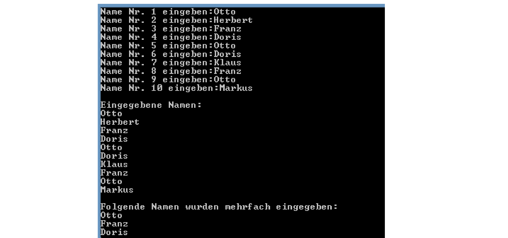

# Duplicates

- Lesen Sie zehn Namen ein und speichern Sie diese in ein String Array. 

- Nach der Eingabe sollen zunächst  alle Namen ausgegeben werden. 

- Danach sollen nur jene Namen ausgegeben werden, welche mehr als einmal eingegeben wurden.
  - Achten Sie dabei darauf, dass mehrfach eingegebene Namen nur 1x ausgegeben werden (siehe "Otto" im Screenshot)! 

