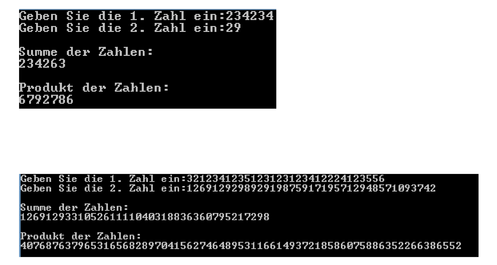

# BigInt

Entwickeln Sie eine Anwendung, mit der beliebig große natürlich Zahlen addiert und multipliziert werden können. Implementieren Sie hierfür die folgenden Methoden:

## `readBigInt`

Liest eine beliebig lange Zahl ein und liefert diese als ``String`` zurück. Solange die Eingabe andere Zeichen als Ziffern enthält, wird diese wiederholt. Die Eingabeaufforderung wird der Methode als `String` übergeben.

## `addLeadingChars`

Ergänzt vor einen übergebenen `String` eine bestimmte Anzahl an Zeichen. Der zu ergänzende `String`, das Zeichen und die Anzahl der Zeichen werden an die Methode übergeben. Die Methode liefert den neuen `String` zurück. 

Beispielsweise gibt `addLeadingChars("1234", '0', 5)` den `String` `"000001234"` zurück.

## `addBigInts`

An diese Methode werden zwei natürliche Zahlen als `String` übergeben. Die Methode addiert die beiden Zahlen in den `String`s (ziffernweise) und gibt das Ergebnis als `String` zurück. 

Hinweis: Die zwei `String`s vorher auf gleiche Länge bringen, indem der kürzere `String` mit führenden Nullen auf die Länge des längeren `String`s aufgefüllt wird (`addLeadingChars`-Methode verwenden).

## `multiplyBigIntWithDigit`

An diese Methode wird als 1. Parameter eine natürliche Zahl als `String` übergeben und als 2.  Parameter eine einzelne Ziffer von 0-9 (Datentyp int). Die Methode gibt das Produkt der beiden Parameter als `String` zurück. 

Hinweis: Die Multiplikation kann als mehrmalige Addition implementiert werden. 

## `multiplyBigInts`

Es werden zwei natürliche Zahlen als `String` übergeben. Die Methode gibt das Produkt der beiden Zahlen als `String` zurück! 

Hinweis: `multiplyBigIntWithDigit`-Methode verwenden!

**Testen Sie im Hauptprogramm ihre Methoden!**

