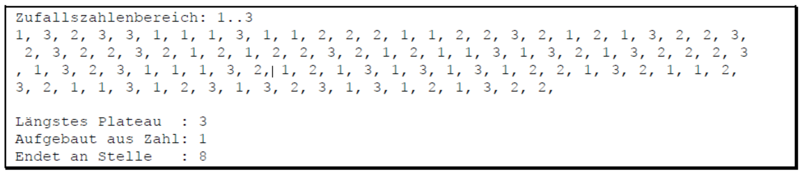

# Number Plateau

Mit Hilfe des Zufallszahlengenerators lassen wir uns eine Folge von 100 Zufallszahlen mit Werten zwischen 1 und einer vom User wählbaren Obergrenze ermitteln. Diese Folge geben wir auf der Konsole aus und versuchen gleichzeitig, das längste Zahlenplateau (Länge / Zahl / Endposition) zu ermitteln. 

Unter einem Zahlenplateau verstehen wir eine Folge von gleichen Werten – und unter dessen Länge die Anzahl der gleichen Zahlen. Die Ausgabe soll wie folgt aussehen:

