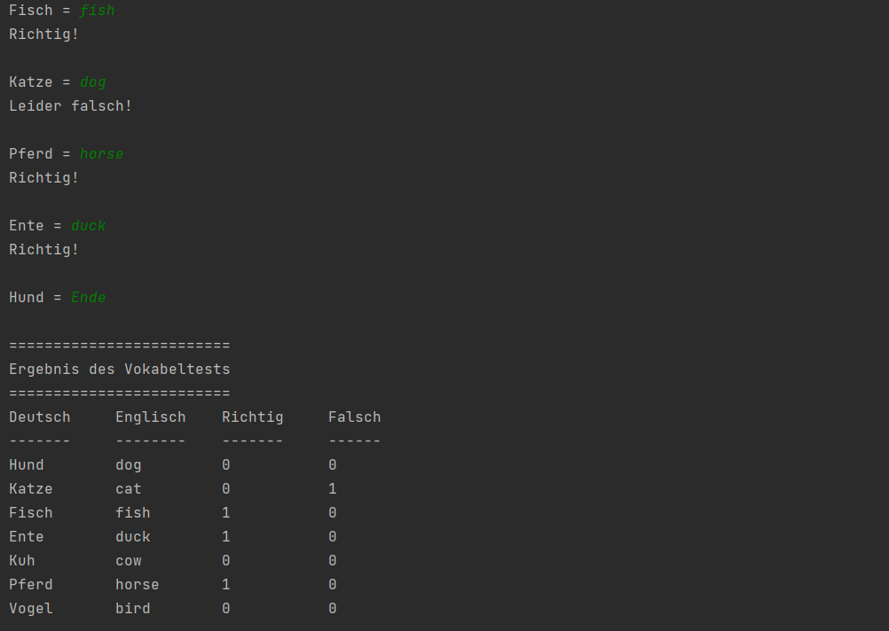

# Vocabulary Trainer

Aus einem 2-dimensionalen String-Array, das deutsche und dazugehörige englische Vokabel enthält, sind mit Hilfe eines Zufallszahlengenerators Vokabel auszuwählen, die in Deutsch ausgegeben werden. 

Der User hat die Aufgabe, die richtige englische Übersetzung einzugeben.  Anschließend wird am Bildschirm  ausgegeben, ob die Übersetzung korrekt  oder falsch war. Für jedes getestete Vokabel ist in einem weiteren 2-dimensionalen Integer-Array abzuspeichern, wie oft es falsch und wie oft es richtig übersetzt wurde.  

Gibt der Benutzer „Ende“ oder gar nichts ein (Enter-Taste), dann wird das Ergebnis des Vokabeltests ausgegeben. Bei der Formatierung ist dem unten abgebildetem Beispiel zu folgen. Verwenden Sie Methoden, um Ihr Programm zu strukturieren!



**Hinweis:** Deklarieren Sie **oberhalb** der `main`-Methode folgende Konstanten und verwenden Sie diese bei jedem Array-Zugriff!

```java
final static int DE = 0;
final static int EN = 1;
final static int WRONG = 0;
final static int CORRECT = 1;
```