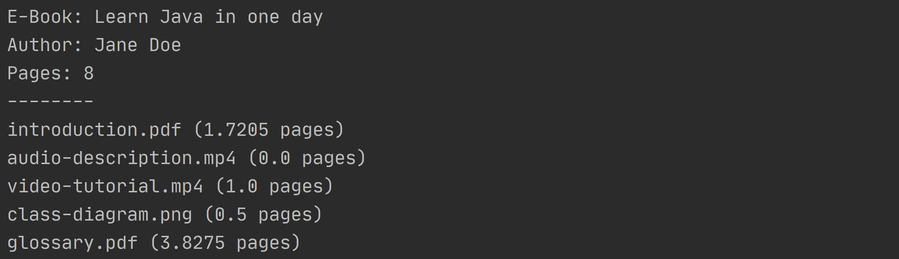

# E-Book

## Inhalte

- Klassendiagramme
- Vererbung

## Beschreibung

Mithilfe von Klassen sollen die Bestandteile eines E-Books verwaltet werden. Über den Aufbau der E-Books ist folgendes bekannt:

> Ein E-Book verfügt über einen Titel, einen Autor und ein Erscheinungsjahr. Es stellt eine Methode zur Berechnung der Gesamtseitenzahl (als Integer-Wert) zur Verfügung.
>
> Die Medien aus denen sich ein E-Book zusammensetzt, werden als Media Assets bezeichnet. Alle Media Assets verfügen über einen Dateinamen.  Spezielle Media Assets für Texte, Bilder, Audios und Videos besitzen weitere Eigenschaften:
>
> - Text Assets speichern die Anzahl an Zeichen.
> - Bild und Video Assets speichern die Breite und Höhe (in Pixel).
> - Audio und Video Assets speichern die Spieldauer (in Sekunden).
>
> Alle Assets besitzen eine Methode zur Berechnung der Seitenzahl (als Float-Wert):
>
> - Bei Texten wird für 2000 Zeichen jeweils eine Seite abgeschätzt.
> - Bei Bildern und Videos wird die Pixelbreite unter Beibehaltung der Seitenverhältnisse auf 960 Pixel skaliert. Liegt die skalierte Pixelhöhe über 600 Pixel, wird eine Seite abgeschätzt, andernfalls eine halbe Seite.
> - Audiodaten tragen nicht zur Erhöhung der Seitenzahl bei.

## Aufgabenstellung

Zeichnen Sie händisch ein UML-Klassendiagramm, dass die beschriebenen Zusammenhänge modelliert. Implementieren Sie anschließend die im UML-Diagramm modellierten Klassen. 

## Test

Erzeugen Sie in der `main`-Methode das E-Book "Learn Java in one day" von "Jane Doe" (2020), mit folgenden Media Assets:

- "introduction.pdf", 3441 Zeichen

- "audio-description.mp4", 95 Minuten
- "video-tutorial.mp4", 800x800 Pixel, 20 Minuten
- "class-diagram.png",  2000x600 Pixel
- "glossary.pdf", 7655 Zeichen

Geben Sie die Informationen des E-Books auf der Konsole aus:

**Tipp:** Überschreiben Sie für die Ausgabe die `toString`-Methode des E-Books und der Media Assets.