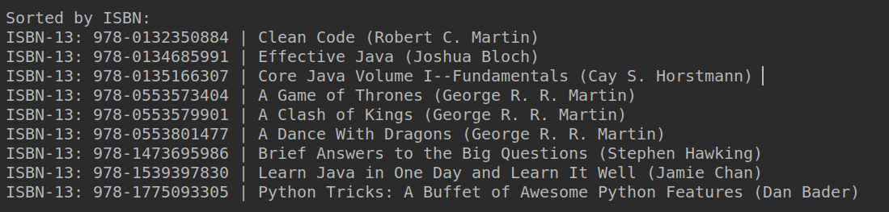

# Bücherregal

Die Datei `books.csv` enthält zu mehreren Büchern folgende Informationen:

- ISBN (International Standard Book Number)
- Buchtitel
- Buchautor

Ihr Programm soll ein digitales Bücherregal mit diesen Werken befüllen. Anschließend sollen die Bücher sortiert und ausgegeben werden.

## Erstellung der Klassen

Erstellen Sie die Klasse `Book` mit Felder und Gettern/Settern für die oben genannten Bucheigenschaften. 

Erstellen Sie anschließend eine Klasse `Bookshelf`, dass über folgende Felder verfügen soll:

- `Book[] books`
- `int bookCount`

Die Klasse soll über folgende Konstruktoren verfügen:

- `Bookshelf()`
- `Bookshelf(int maxBooks)`

Im Standardkonstruktor wird festgelegt, dass 20 Bücher in dem Regal Platz haben.

**Achtung:** Die Klasse verfügt über **keine** Getter/Setter.

## Befüllen des Bücheregals

Implementieren Sie die Methode `addBook()` der Klasse `Bookshelf`. Diese soll dem `books`-Array ein neues `Book`-Objekt mit den übergebenen Daten (ISBN, Titel, Autor) hinzufügen.

Erstellen Sie anschließend in der `main()`-Methode eine Instanz der Klasse `Bookshelf`. Befüllen Sie das Regal in der `main-Methode mit den Büchern aus der`books.csv`.

**Hinweis:** Die Datei muss **nicht** eingelesen werden. Übernehmen Sie stattdessen die Daten aus der CSV-Datei *hardcoded* in Ihre `main`-Methode

## Ausgabe des Bücherregals

Implementieren Sie die Methode `printBooks()` der Klasse `Bookshelf`. Die Ausgabe der Bücher soll wie unten dargestellt aussehen. Übeschreiben Sie für die Ausgabe die Methode `toString()` der Klasse `Book`.

## Sortierung der Bücher nach ISBN

### `Comparable`-Interface

Implementieren Sie in der Klasse `Book` das Interface `Comparable<Book>`. In der Methode `compareTo()` sollen die ISBNs der Bücher verglichen werden. 

Implementieren Sie anschließend in der Methode `sortBooksByIsbn()` der Klasse `Bookshelf` einen beliebigen Sortieralgorithmus. Verwenden Sie dabei die `compareTo()`-Methode der Klasse `Book`. 

Rufen Sie `sortBooksByIsbn()` in der `main`-Methode vor der bereits vorhandenen Ausgabe der Bücher auf. Fügen Sie auch noch die unten dargestellte Überschrift hinzu.

## Sortierung der Bücher nach Titel

### `Comparator`-Interface

Implementieren Sie in der Klasse `TitleComparator` das Interface `Comparator<Book>`. In der Methode `compare()` sollen die Titel der Bücher bezüglich ihrer alphabetischen Reihenfolge verglichen werden. Wandeln Sie die Titel in Kleinbuchstaben um und vergleichen Sie anschließend zeichenweise den ASCII Code der Character.

Implementieren Sie die Methode `sortBooks()` der Klasse `Bookshelf`. Die Methode soll das`books`-Array mithilfe der vorhandenen Sortierfunktion `java.util.Arrays.sort()` und des an `sortBooks()` übergebenen `Comparators` sortieren. 

Rufen Sie `sortBooks()` in der `main`-Methode auf und übergeben Sie dabei als Argument eine neue Instanz der Klasse `TitleComparator`. Geben Sie anschließend die Bücher mit einer entsprechenden Überschrift aus. Die Konsolenausgabe sollte nun folgendermaßen aussehen:

## Sortierung der Bücher nach Autor

Erweitern Sie ihr Programm (analog zur Sortierung nach Titel) um eine alphabetische Sortierung nach Autor:

- Implementieren Sie in der Klasse `AuthorComparator` das Interface `Comparator<Book>`.
- Erweitern Sie die `main`-Methode, sodass auch die Sortierung nach Autor ausgegeben wird.

Abschließend ist die finale Konsolenausgabe Ihres Programms dargestellt:

